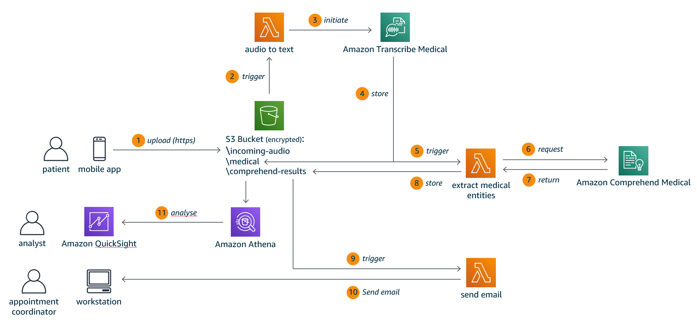
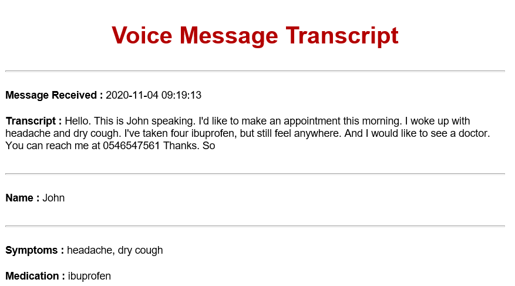
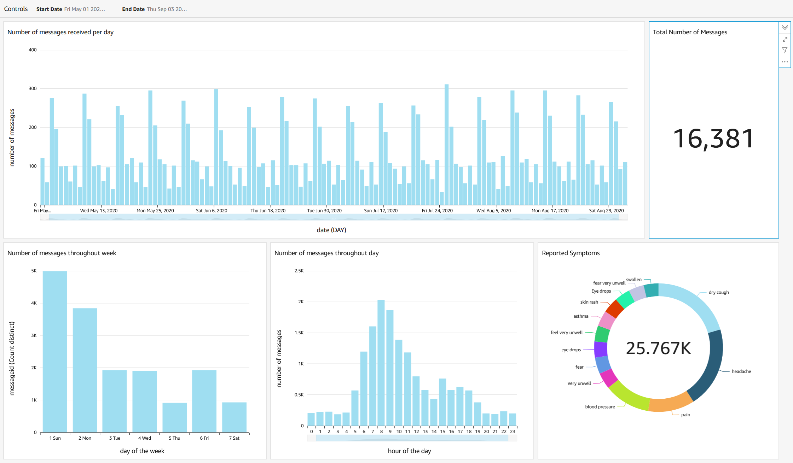

# Appointment Concierge

Appointment Concierge is a demo application that allows a patient to record and
send a voice message to his healthcare provider and request an appointment. The 
application uses [Amazon Transcribe Medical](https://aws.amazon.com/transcribe/medical/) 
to transform the voice message into text and 
[Amazon Comprehend Medical](https://aws.amazon.com/comprehend/medical/) to derive
meaningful information. The information extracted from the message is used to 
generate an email for an appointment coordinator. Furthermore, message data is 
analyzed and presented in a dashboard using the 
[Amazon QuickSight](https://aws.amazon.com/quicksight/) service.



The application is built following an event driven architecture. (1) a patient uses a mobile 
application to record a voice message. For this demo we utilize the iPhone Voice Memo app.
Using a [Pythonista](https://omz-software.com/pythonista/) script The message is then uploaded to
a S3 bucket with a `incoming-audio\ ` prefix. (2) any new file
 triggers the
`audio to text` Lambda function. (3) the Lambda function initiates the job for Amazon Transcribe
Medical. (4) once the transcription has been completed, the extracted text is stored on S3 under
the `medical\ ` prefix. (5) this then triggers the `extract medical entities` Lambda function. (6
) & (7) this Lambda function takes the extracted text and calls Amazon Comprehend Medical
to identify medical entities and their relationships (e.g. symptoms, medication names
, body parts). (8) results are stored under the `comprehend-results\ ` prefix. (9
) & (10) Lambda function `send email` is then triggered. This Lambda function uses the comprehend
results to compose and send an email. The image below shows a sample email.



The text shown after "Transcript :" is the result from Amazon Transcribe Medical. Any "Names
 :", "Symptoms :" and "Medication :" are identified via Amazon Comprehend Medical. The idea
behind the demo is that this information can then be used by an appointment coordinator to
prioritize patient and doctor appointments. (11) For further analysis of the processed messages
the [Amazon Athena](https://aws.amazon.com/athena/) and 
[Amazon QuickSight](https://aws.amazon.com/quicksight/) services can be utilized. The image below
shows a sample QuickSight dashboard displaying number of messages received at different time
scales (months, days of the week, hour of the day) and a distribution of the various symptoms
reported.



### Setup

The architecture described above can be deployed automatically to your AWS account. The
deployment uses a [AWS Cloud Development Kit](https://aws.amazon.com/cdk/) script. For a
comprehensive introduction tutorial for CDK I recommend to work through Darko Meszaros' 
[Building Serverless Applications with CDK - Workshop](https://github.com/darko-mesaros/workshop-serverless-with-cdk)

After cloning the Appointment Concierge Git repository with ...

```bash
git clone https://github.com/SophonAlpha/AppointmentConcierge.git environment/
```

... run the following commands ...

```bash
cd environment/CDK
npm run build
cdk deploy
```

The CDK script deploys the S3 bucket, Lambda functions, defines event triggers and sets the required
 permissions. The
source code for the script can be found in ...

```
AppointmentConcierge\CDK\lib\cdk-stack.ts
```

The source code for the Lambda functions can be found in ...

```
AppointmentConcierge\AppointmentConcierge\AudioToText\audio_to_text.py
AppointmentConcierge\AppointmentConcierge\ExtractMedicalEntities\extract_medical_entities.py
AppointmentConcierge\AppointmentConcierge\SendEmail\send_email.py
```

To upload an audio file recorded with the iPhone Voice Memo app you can use the Pythonista script
found in ...

```
AppointmentConcierge\Pythonista\upload_audio.py
```

For a tutorial for how to create a custom Share Extension that will allow to use Pythonista to
upload a file to S3 please see section "Python Client Library" in James Ridway's tutorial for 
[Transcribing Voice Notes on the iPad with AWS Transcribe](https://www.jamesridgway.co.uk/transcribing-voice-notes-on-the-ipad-with-aws-transcribe/).
